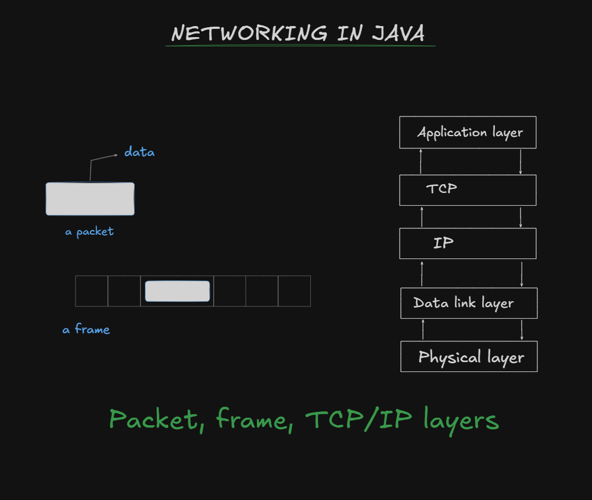

# TCP/IP Protocol

A protocol represents a set of rules to be followed by every computer on the network. Protocol is useful to physically move data from one place to another place on a network. TCP (Transmission Control Protocol) / IP (Internet Protocol) is the standard protocol model used any network, including Internet.

## 🌐 TCP/IP Layers model has got the following 5 layers:

1. Application Layer
2. Transport Layer (TCP/UDP)
3. Internet Layer (IP)
4. Data Link Layer
5. Physical Layer

Application layer is the topmost layer of the TCP / IP model that directly interacts _with an application (or data). This layer receives data from the application and formats the data. Then it sends that data to the next layer called TCP in the form of continuous stream of bytes. The TCP, upon receiving the data from the Application layer, will divide it into small segments called packets'. A packet contains a group of bytes of data. These packets are then sent to the next IP layer. IP layer inserts the packets into envelopes called 'frames'. Each frame contains a packet, the IP address of destination computer, the IP address of source computer, and some additional bits useful in error detection and correction. These frames are then sent to Data link layer which dispatches them to correc physically transmit data on the network using the appropriate hardware.
Of course, to send data from one place to another, first of all the computers should be correctly identification number given to every computer on the network. It contains four integer numbers in identified on the network. This is done with the help of IP addresses. An IP address is a unirue the range of 0 to 255 and separated by a dot as:
`87.248.113.14`
on a server machine on Internet as: This IP address may represent, for example a website www.yahoo.com Therefore, to open yahoo.com site, we can type the site address as www.yahoo.com' or its IP mapped to the website automatically. This mapping service is available or Internet, which is called address as **87.248.113.14**. But when we type the IP address in numeric form, that number is **DNS**(Domain Naming service).

---

On Internet, IP addresses of 4 bytes are used and this version is called IP address version 4. The next new version of IP address is version 6, which uses 16 bytes to identify a computer. Shows the packet, frame and TCP/IP layers

Shows the packet, frame and TCP/IP layers.

**TCP/IP takes care destination computer...**

TCP/IP takes care destination computer. So it is called " connection oriented reliable protocol' of the number of bits sent and whether all the bits are received duly by the Every transmitted bit is accountable in this protocol. Hence, this protocol is highly suitable for transporting data reliably on a network. Almost all the protocols on Internet use TCP/IP model internally HTTP (hyper text transfer protocol) is the most widely used protocol on Internet, which is used to transfer web pages (.html files) from one computer to another computer on Internet. FTP (file transfer protocol) is useful to download or upload files from and to the server. SMTP (simple mail transfer protocol) is useful to send mails on network. POP (post office protocol) is useful to receive mails into the mail boxes